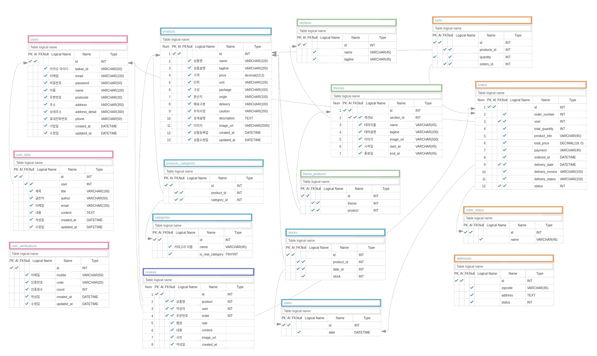

# Introduction

당일 배송 수산마켓 서비스 [오늘회 웹사이트](https://www.onul-hoi.com) 클론 프로젝트
- 기간    : 20.02.24 - 20.03.06
- 팀 구성 : 프론트엔드 4명, 백엔드 2명 (총 6명) 
- [we-fish-FrontEnd GitHub Repository &#128205;](https://github.com/wecode-bootcamp-korea/we-fish-frontend)

# DB modeling

&nbsp;
&nbsp;
&nbsp;

User Tables

&nbsp;
### users
- 가입 회원의 정보를 저장합니다.

&nbsp;
### user_asks
- 1:1문의에 대한 기록을 남깁니다.

&nbsp;
### user_verifications
- 휴대폰 인증에 대한 기록을 남깁니다.

&nbsp;
&nbsp;

Product Tables

&nbsp;
### categories
- 상품 카테고리 정보를 저장합니다.
- 카테고리 목록에 표시되는 카테고리인지 여부가 BOOLEAN 필드로 구분됩니다. 

&nbsp;
### products
- 상품의 정보를 저장합니다.
- 카테고리와 MANY TO MANY 관계를 이룹니다.
- 상세설명은 html 태그로 되어 있습니다.
- 상품 등록일이 7일 이내일일 경우 신상품 카테고리로 구분됩니다.

&nbsp;
### products_categories
- 상품과 카테고리의 관계정보를 저장합니다.
- 상품과 카테고리는 외부키를 가져옵니다. 

&nbsp;
### dates
- 상품 배송이 가능한 날짜를 저장합니다.
- 오늘 이후 5일을 도착 날짜포 표시할 수 있습니다.

&nbsp;
### stocks
- 상품의 날짜별 배송가능 수량을 저장합니다.
- 상품과 날짜는 외부키를 가져옵니다.
- 상품의 날짜별 수량이 없어지면 배송가능 날짜가 다음날로 바뀝니다.

&nbsp;
### sections
- themes 의 상위 카테고리
- 각 테마의 조합을 저장합니다.

&nbsp;
### themes
- 테마 정보를 저장합니다.
- 테마는 한 개의 섹션에 속하도록 외부키를 가져옵니다.

&nbsp;
### theme_products
- 테마의 상품 구성을 저장합니다.
- 상품은 외부키로 가져옵니다.

&nbsp;
### reviews
- 상품별 상품후기를 저장합니다.
- 상품명, 작성자, 주문번호는 외부키를 가져옵니다.
- 상품별 후기를 가져올 수 있습니다.
- 주문번호에 해당하는 후기를 가져올 수 있습니다.

&nbsp;
&nbsp;

Order Tables

&nbsp;
### carts
- 장바구니 정보를 저장합니다.
- 주문번호를 외부키로 가지며 장바구니에 상품을 넣으면 `orders`에 주문번호가 자동으로 생성됩니다.

&nbsp;
### orders
- 장바구니에서 결제하기를 누를 경우 장바구니의 상품 정보를 그대로 가져옵니다.
- 상품 목록과 주문 금액 그리고 결제방법, 배송 정보를 저장합니다.
- status 칼럼에서 주문완료 여부를 구분합니다.
- `carts` 테이블과 조인하면 상품별 누적판매 수량으로 인기상품 정렬할 수 있습니다.

&nbsp;
### addresses
- 배송 가능 지역 목록을 저장합니다.
- 회원가입시, 배송지 변경시 우편번호로 배송 가능 여부를 판단할 수 있습니다.

&nbsp;
&nbsp;

# Technologies
- Python
- Django Web Framework
- MySQL
- AWS EC2, RDS
- CORS headers
&nbsp;
&nbsp;

# Features
**Data**
- 크롤링(BeautifulSoup, Selenium)

**User**
- 회원가입, 로그인(Bcrypt, JWT)
- 소셜로그인(Kakao API)
- 휴대폰 인증(Naver API)
- 내 정보 관리
- 1:1 문의

**Product**
- 카테고리 보기
- 카테고리내 상품 목록 보기(정렬 방식 선택 가능)
- 상품 상세 보기
- 상품후기 작성
- 상품후기 보기

**Order**
- 장바구니 담기
- 장바구니 보기
- 장바구니 상품 수정
- 주문완료 내용 보기

&nbsp;
&nbsp;
# API Documentiaion
[백엔드 엔드포인트 API](https://documenter.getpostman.com/view/10398614/SzRw2WX9?version=latest)
&nbsp;
&nbsp;
# Contact
- whybein : swhybeing@gmail.com
- k904808 : k904808@gmail.com
&nbsp;
&nbsp;
